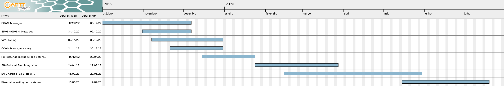
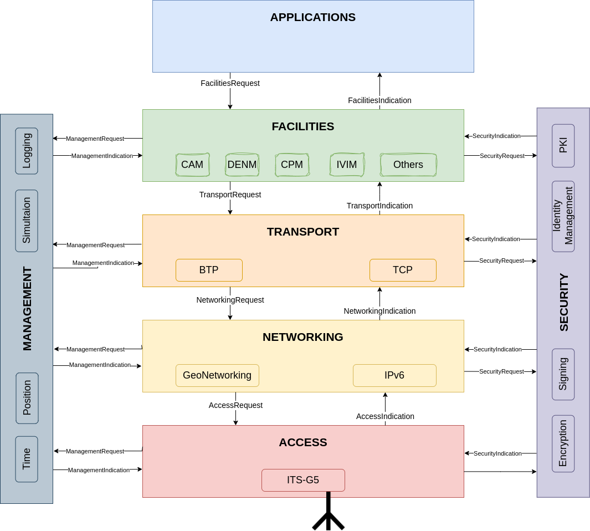

# Dissertation
This repo contains all the documents related to the making of my master thesis. The dissertation was defended on 12/07/2024 and got a grade of 18/20.

[See on Overleaf](https://www.overleaf.com/read/kgnwtrzpwtpt)

# Pre-Dissertation
January 20 marks the deadline for the pre-dissertation.
With it the first 2 chapters should be "ready" and a gantt diagram was built to try to predict the work that needs to be done using broad topics:

# Simple explanation about some of the programs involved:
## it2s-mobile-app
Private Repository on the  gitlab of the Telecommunications Institute of Aveiro. This is the mobile app that is being developed for the project. Done using Expo and React Native.
I used react-native-maps with Google Maps, react-native-paho-mqtt for the websocket MQTT client and expo-sensors for sensor data collection.

### Contributions
- I contributed with a [PR]( https://github.com/expo/expo/pull/18225 ) to expo-sensors that adds the light sensor implementation on android which was integrated into Expo on sdk 47!
- At Telecommunications Institute we've published a [journal paper](https://www.mdpi.com/1424-8220/23/3/1724) that was choosen as an Editor's Choice Article by the Sensor editors at MDPI.

## it2s-json-broker
Private Repository on the IT's gitlab.
Program written in C with multithreading that acts as a compiler. The program connects to an MQTT broker and subscribes and publishes the translated messages, configurable using a toml file. It receives messages that are then translated from UPER/XML to JSON.

## it2s-tms
This repository is no longer mantained by me and corresponds to this [website](https://ccam.av.it.pt). It was created by two colleagues at IT and is a React app that also, like the mobile application, uses the json broker to display the message contents on a map. It is also used to send messages, such as road and weather events, to the broker.

# ITS stations
ITS stands for Intelligent transport systems and examples of stations are RSU (road side units) and OBUs (on board units) which are present in vehicles.
A lot of work was done on the stack integrating:
    - our own Smartphone sensor (SPVSM) and OBD-II sensor (OVSM) messages that are then combined into a single message (VSM) and sent to the cloud broker, when a the mobile app is connected to an OBU, for other ITS applications.
    - EV charging andvertisement (EVCSNM) and reservation (EVRSRN) messages and logic specified by etsi. 
    Mainly on the facilities layer which corresponds to the layer 5, 6 and 7 and provides its applications with shared data and access to common functionalities. See the image of the its station architecture below:

# Work reported:
Note that the work reported here is not the same as the one reported on the pre-dissertation. From then on the work report was done directly to my supervisor and not to the university and so is not present from December on.
## 30 NOV/22 - 31 DEC/22
it2s-mobile-app:
- custom colors for the user's marker
- cams set the userRegion and refresh interval is now 150ms
- fix for SAEMs where the tolling zones were not displayed correctly
- Full, user mode context dependent, message history!

- Helped writing a paper about sensor data collection.
Pre-Dissertation writing.                  });

## 31 OCT/22 - 30 NOV/22
it2s-mobile-app:
- Updated message format of OVSM
- Introduced the light sensor 
- Screen dedicated to sensors
- Message History (for denms)

it2s-json-broker:
- Fixed SAEMs intermediary UPER decoding of multiple applicationDataSams

## 30 SET/22 - 31 OCT/22
it2s-mobile-app: 
- Screen para visualização do estado dos sensores utilizados e devidas traduções 
- Fixes para as SVSMs - Adaptação total das mensagens para o novo formato imposto pelo jer_encoder 
- Adicionadas SAEMs e TPMs it2s-tms: - Código adaptado para receber e usar o novo formato imposto pelo jer_encoder

it2s-json-broker: 
- SAEMs e TPMs adicionadas 
- Removidos temp fixes 

## 31 JUL/22 - 30 SET/22

it2s-json-broker: 
- SAEMs e TPMs adicionadas
- Removidos temp fixes

it2s-mobile-app:
- Screen para visualização do estado dos sensores utilizados e devidas traduções
- Fixes para as SVSMs
- Adaptação total das mensagens para o novo formato imposto pelo jer_encoder
- Adicionadas SAEMs e TPMs 

it2s-tms:
- Código adaptado para receber e usar o novo formato imposto pelo jer_encoder
